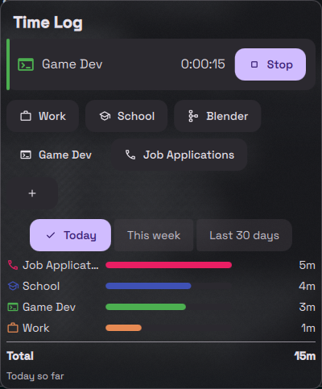

# Dank Time Log

A [DankMaterialShell](https://github.com/AvengeMedia/DankMaterialShell) plugin
for tracking time against your own presets (Work, Study, ...) and seeing how
much time goes to each per day.



## Features

- Bar pill with the running preset's icon and elapsed time.
- Popout to start, switch, and stop the timer, and to add a preset by name.
- Averages chart for today, this week, or the last N days, with the total.
- Settings to add, rename, recolor, and change the icon of presets, archive
  them, and delete archived ones along with their history.
- One timer at a time: switching closes the running session at the same
  instant the new one starts.
- The timer stops when the machine suspends or powers off, at the last
  heartbeat before the gap, and stays stopped until you start it again.
- IPC commands for keybindings.

## Requirements

DankMaterialShell 1.6.2 or newer. No other dependencies.

## Installation

From the plugin browser in DMS: Settings → Plugins → Browse, then search for
Dank Time Log.

Manually:

```sh
git clone https://github.com/bash-win/DankTimeLog ~/.config/DankMaterialShell/plugins/DankTimeLog
```

Then in Settings → Plugins, press Scan and enable Dank Time Log, and add the
widget to your bar in Settings → Bar → Widgets.

## IPC

| Command | Effect |
|---|---|
| `dms ipc call dankTimeLog start <name>` | Start the preset, or switch to it |
| `dms ipc call dankTimeLog stop` | Stop the running timer |
| `dms ipc call dankTimeLog toggle <name>` | Stop the preset if it is running, otherwise start it |
| `dms ipc call dankTimeLog status` | Running preset and elapsed seconds, tab-separated; empty when stopped |

Names match a preset's display name or id, ignoring case. For example, in niri:

```kdl
binds {
    Mod+Shift+W { spawn "dms" "ipc" "call" "dankTimeLog" "toggle" "work"; }
}
```

## Data

- Sessions: `~/.local/state/DankMaterialShell/plugins/dankTimeLog_sessions.json`
- Last heartbeat: `~/.local/state/DankMaterialShell/plugins/dankTimeLog_heartbeat.json`
- Presets and the chosen chart range: DMS plugin settings.

The plugin makes no network requests and runs no external commands.

## Development

`./check.sh` runs `qmlformat` and `qmllint` over the QML and the `node --test`
suites for the `.mjs` modules. It needs the Qt 6 declarative tools and Node.
[DESIGN.md](DESIGN.md) covers the timer rules, the averages, and storage.

## License

MIT. See [LICENSE](LICENSE).
